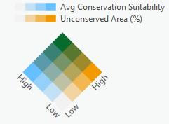
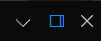
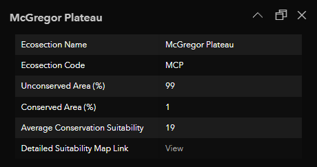
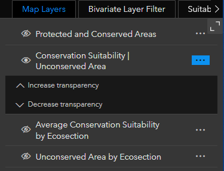
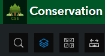
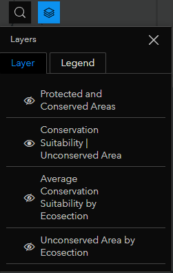
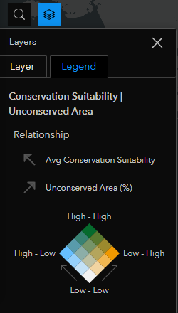
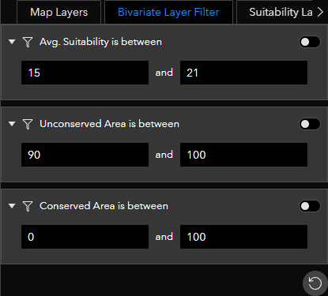
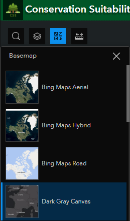
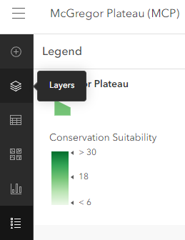

# Conservation Suitability Explorer (CSE) by Team GeoJAM

## Team
- Junior Thiensirisak
- Anthony Wong
- Michael Wong
  
## Mission Statement  
On December 9, 2022, the federal government of Canada set a goal of conserving 30 percent of the country’s land and water by 2030. Canada has conserved or protected 13.6% of its land (equivalent to 1,355,029 km2) and 14.6% of its water (842,828 km2) by area as of December 2022. Therefore, in the next seven years, Canada will need to protect an additional 16.4% of its land (1,637,486 km2) and 15.4% of its water (or 885,500 km2) to meet its conservation goals.

GeoJAM’s mission is to assist decision makers, organizations, and conservationists in finding and prioritizing terrestrial areas for conservation. Our app, Conservation Suitability Explorer, is an interactive and visual information product that presents map layers that can be used to inform conservation efforts in British Columbia. Although this project focuses on the province of British Columbia, our ideas and methods could be adapted to the entirety of Canada as well as extended to include marine areas.

## About our App

How would someone go about choosing what land to conserve? This is a question that Team GeoJAM wanted to answer. We have integrated over 16 datasets, including over 3.7 million ecological observations, to evaluate the conservation suitability of all terrestrial locations in British Columbia. Our main app shows a broad evaluation based on summary information for each of the 137 terrestrial ecosections that encompass British Columbia. We have also created 137 individual maps that display our conservation suitability analysis at the original resolution of 30m for each ecosection.

The Conservation Suitability Explorer aims to inform decision makers and conservationists, as well as anyone interested in conservation, about British Columbia’s current conservation efforts and identify regions that have a high potential for acquiring additional conservation lands. Our app summarizes large amounts of data in a simple map that is easy to understand, GIS and/or ecological expertise is not required to make use of the CSE!

## User Guide

### The Map: Default View
The default view presents users with a bivariate map (which is just a fancy way of saying it combines two variables that are symbolized with separate colour scales) that combines two datasets, “Average Conservation Suitability” and “Unconserved Area”. The data is summarized into the 137 terrestrial ecosections of BC. The bivariate visualization method allows us to easily identify the attributes of an ecosection by its colour (see colour scheme below). Areas that have high amounts of unconserved area are orange and areas with high average conservation suitability values are blue. Areas that have high values of both variables will be green and represent the ecosections with the highest potential for claiming new conservation lands.

Selecting an ecosection on the map will give a popup window of the ecosections attributes. It is highly recommended to press the “dock” button in the top right corner of the popup to keep it off to the side but still fully visible (see below, highlighted in blue). 

The following attributes are displayed in the popup:

The Ecosection Name and Ecosection Code fields contain the name and code for each ecosection.

The Unconserved and Conserved Area fields represent the percentage of land within an ecosection that is either unconserved or conserved. The range of both values is 0 to 100.

The Average Conservation Suitability field represents the average conservation suitability value within an ecosection. This value was calculated from the detailed conservation suitability map. The maximum suitability score in our methodology was 50, and the minimum was 2. The analysis produced values ranging from 2 to 37. The range for average suitability values within ecosections ranges from 5 to 21. See the methodology section for more details.

The Detailed Suitability Map Link field contains a link to a detailed map for an ecosection. These maps were generated using our methodology (see Methodology section) and were processed at a resolution of 30m.

### The Map: Additional Layers and Legend

The map has a total of four layers, three of which are hidden by default. Use the “Map Layers” widget to toggle the visibility of each layer by clicking the eye icon. You can also click the three dots to the right of a layer to modify the transparency of a layer. Changing the transparency will allow you to see what the surface of an ecosection actually looks like.

Layer visibility may also be toggled through the “Layers” button (highlighted in blue below) in the top left.

The “Protected and Conserved Areas” layer is hidden by default but is very useful to toggle on. With it on (it will display as a bright green) you can see what areas are currently conserved in BC. Attributes for this layer include the “Name”, “Enabling Mechanisms”, and “Designation Type” of the protected/conserved area.

The “Average Conservation Suitability by Ecosection” and “Unconserved Area by Ecosection” are the two layers that make up the bivariate map. These are presented here in separate layers so that they may be viewed individually.

To view the legend and colour scales for the visible layers, click on the previously mentioned “layers” button and switch to the legend tab.

### The Map: Filter Tools and Basemap Options

Filters for Average Conservation Suitability, Unconserved Area, and Conserved Area are available for the following layers:
* Conservation Suitability | Unconserved Area: “Bivariate Layer Filter”
* Average Conservation Suitability by Ecosection: “Suitability Layer Filter”
* Unconserved Area by Ecosection: “Unconserved Layer Filter”

Enter values for the bottom and top of the range and then toggle the switch to apply the filter. This is convenient if you only want to see ecosection with certain ranges of attributes. For example, you could filter the average suitability from 15 to 21 and the unconserved area from 90 to 100 to only see areas with highest potential for conservation. We recommend changing the basemap from the default “Imagery Hybrid” to the “Dark Gray Canvas” when using filters for increased contrast, this can be done using the “Basemap” button in the top left (highlighted in blue below). You may also change the basemap to whatever suits your needs.

### The Table

The table defaults to the data of the “Conservation Suitability | Unconserved Area” layer which presents the same data that you will find in the popups. Searching (by name or code) and scrolling is available to navigate through the table to find or select an ecosection. Selecting an ecosection in the table will zoom the map to that ecosection. 

The fields within the table are sortable by ascending and descending, so you can easily find the ecosections with the highest average conservation suitability or greatest amount of unconserved area. Use the drop down at the top of the table to view the data for the other layers if desired.

The vertical height of the map/table can be adjusted by grabbing and dragging the grey bar (between the two elements) up and down.

### The Detailed Conservation Suitability Maps

Due to the scale and density at which the conservation suitability analysis was performed, the detailed maps have been separated into individual maps for each ecosection for performance reasons. Each of these maps shares the same colour scale for consistency. In addition to the conservation suitability values, the individual maps contain the data for Protected and Conserved Areas; use the layers tab to access the layer visibility toggle.

## Project Methodology and Strategy
To perform the conservation suitability analysis using the obtained datasets, we first had to convert them into common data types. The majority of data collected were in a vector format and needed to be converted to raster datasets as they are more appropriate for suitability analysis. This section discusses the general methodology, strategy, and logic used to process data and conduct the analyses for our project. We also discuss limitations and areas where there is room for improvement.

### Percentage of Protected and Conserved Lands
This layer was created in order to assist us in determining which ecosections have potential to increase their protected and conserved land area by examining the ecosections with a low percentage of current protected and conserved land area. To determine the percentages, the Ecosection and Protected/Conserved Area polygons are required. This is procedure we created to determine those values:
1. Intersect the Ecosections and Protected/Conserved Lands 
2. Summarize Within for Ecosections with the Intersected Layer, summing the shape area
3. Calculate Field to get percentages of Protected/Conserved Lands within each Ecosection

### Land Use and Biogeoclimatic (BEC) Zones
These datasets consisted of detailed polygon features and were converted to rasters and reclassified based on land use types and BEC zones.

### Calculating the Number of Critical Habitats in a Location
The critical habitats data contained overlapping habitats for different species. We calculated the total number of unique habitats for a location by using a combination of the Union, Multipart to Singlepart, and Spatial Join tools. The number of overlapping critical habitats ranged from 0 to 10.

### Calculating Riparian and Wetland Areas
Using the rivers dataset from the Freshwater Atlas, we applied a 30m buffer (a common riparian setback distance) to the rivers feature to create a riparian area feature. For wetlands, the dataset from the Freshwater Atlas was used without modification.

### Calculating Species Richness from Observation Data
Species richness was calculated by merging seven government observation datasets and one crowd sourced observation dataset. Observations consisted of both point and polygon vectors. We then established a grid consisting of 900 sq. km. cells over the entirety of BC. Polygon observations were then converted to points (after intersecting with the grid) and the datasets were merged. The data was then dissolved by grid ID and the amount of unique scientific names of species was counted. The number of unique species per grid ranged from 0 to 3609.

### Converting Vector Data to Raster Data
To create the rasters, we simply used the Feature to Raster tool based on certain fields. Since the land cover classification raster (a dataset that was explored for this project, but ultimately not implemented) had a resolution of 30m, we used this cell size for our analysis and created a raster layer of the BC boundary layer so that all conversions could be clipped to that extent.	

### Raster Analysis - Conservation Suitability
Once the raster layers were prepared, we normalized the data to have raster values on a scale of 1-10 and reclassified all cells with no data to have values of 0 instead. This allowed us to sum all the raster layers together to get a suitability score out of 50. The following input raster were used: Land Use, Critical Habitats, Riparian + Wetland Areas, Biogeoclimatic (BEC) Zones, and Species Richness.

### Conservation Suitability Value Scales - Logic and Calculations
**Land Use:** To get a 1-10 scale for land use we analyzed the percentages of each land use type within the currently conserved areas in BC and then compared that to the overall percentage of each land use type within BC. We then reclassified the difference in percentage (Conserved % - Overall %), into 10 classes using a natural breaks method.

**Critical Habitats:** As the results of the overlapping habitats calculations resulted in a range of values from 0-10, the values were used without additional modification.

**Riparian and Wetland Areas:** The rasters for riparian and wetland areas were created in a binary-like format (0 or 1). These values were reclassified into either 0 or 5, and then the riparian and wetlands rasters were added together to create a raster containing values of 0 (neither riparian or wetland), 5 (either riparian or wetland), and 10 (both riparian and wetland).

**Biogeoclimatic Zones (BEC):** To create a 1-10 scale for biogeoclimatic zones, we converted the global range percentages into integers from 1-10. For example, the global range of the Coastal Douglas-fir biogeoclimatic zone is 70-80%, this rounds to 75% and becomes 7.5. The value for Coastal Douglas-fir then becomes 8 after being rounded to an integer.

**Species Richness:** After calculating the unique species per 900 sq. km. grid cell, the values were reclassified into 10 classes using a natural break method.

### Limitations
**Technical**

Since our analysis is based on rasters, it was difficult for us to upload these features onto ArcGIS Online as a layer. To work around this issue, we decided it was best to convert all our rasters back into polygons. This involved the Raster to Polygon tool on the final suitability raster we created. The resolution of our analysis resulted in performance intensive features after being converted into polygons. To display the full details of our conservation suitability analysis while maintaining reasonable performance and load times, the data was split into individual ecosections. Detailed conservation suitability maps are available for each ecosection, links are provided in the attribute table and popup window in the main CSE app.	

**Methodology**

After reviewing scholarly articles and consulting with experts in the field, we concluded that other conservation criteria could be included to make the analysis more robust. However, due to limitations related to time and data access, we were not able to conduct analysis on the following:
Biogeoclimatic Zones at Risk
Underrepresented Ecosystems
Ecosystem Condition
Species Rarity
Viability or Resiliency

There are some notable limitations for our methods of determining conservation suitability values:
Land Use: it would be ideal to have biology or ecology expert evaluate land use types individually and apply custom values instead of conducting a generalized ranking
Biogeoclimatic Zones: the ranking of biogeoclimatic zones should ideally take more factors into consideration than just the global range.
Species Richness: the source of this input dataset is from observational data and therefore has bias to where observations take place, namely more populated areas or areas focused for research or other reasons will have a higher density of observations relative to other areas. The lack of observations in an area does not necessarily mean there is a low species richness in an area.

Our analysis was limited to terrestrial areas as a significant portion of our input datasets only included data for land areas and therefore marine areas were excluded. In addition, there are a total of 139 ecosections within BC; however, there are two ecosections that are fully contained within marine areas, resulting in 137 ecosections included in our analysis. Note that after clipping the ecosections to include only land area, some coastal ecosections became extremely fragmented and small as the majority of their areas were marine.

## Geospatial Open Data Sources
Table 1. Geospatial datasets used in analysis
| <b>Dataset</b> | <b>Data Source</b> | <b>Data Type</b>
| --- | --- | --- |
| BC Province Boundary | <a href="https://open.canada.ca/data/en/dataset/a883eb14-0c0e-45c4-b8c4-b54c4a819edb">Statistics Canada</a> | Polygon |
| Ecosections | <a href="https://catalogue.data.gov.bc.ca/dataset/ccc01f43-860d-4583-8ba4-e72d8379441e">Government of British Columbia</a> | Polygon |
| Protected and Conserved Areas | <a href="https://open.canada.ca/data/en/dataset/6c343726-1e92-451a-876a-76e17d398a1c">Environment and Climate Change Canada</a> | Polygon |
| Land Use Classification BC | <a href="https://catalogue.data.gov.bc.ca/dataset/baseline-thematic-mapping-present-land-use-version-1-spatial-layer">GeoBC</a> | Polygon |
| Species at Risk (Critical Habitat) | <a href="https://open.canada.ca/data/en/dataset/47caa405-be2b-4e9e-8f53-c478ade2ca74">Environment and Climate Change Canada</a> | Polygon |
| Species Richness | See Table 2. Observation Datasets | Point/Polygon |
| Rivers | <a href="https://catalogue.data.gov.bc.ca/dataset/freshwater-atlas-rivers">GeoBC</a> | Polygon |
| Wetlands | <a href="https://catalogue.data.gov.bc.ca/dataset/freshwater-atlas-wetlands">GeoBC</a> | Polygon |
| Biogeoclimatic Ecosystem Classification (BEC) | <a href="https://catalogue.data.gov.bc.ca/dataset/f358a53b-ffde-4830-a325-a5a03ff672c3">Forest Analysis and Inventory Branch</a> | Polygon |

Table 2. Observation Datasets
| <b>Dataset</b> | <b>Data Source</b> | <b>Data Type</b>
| --- | --- | --- |
| iNaturalist Observations | <a href="https://inaturalist.ca/observations">iNaturalist</a> | Point |
| SPI Masked Survey Observations - Publicly Available | <a href="https://catalogue.data.gov.bc.ca/dataset/wildlife-species-inventory-masked-survey-observations-publicly-available">Ministry of Environment and Climate Change Strategy</a> | Polygon |
| SPI Survey Observations - Non-Sensitive | <a href="https://catalogue.data.gov.bc.ca/dataset/wildlife-species-inventory-survey-observations-non-sensitive">Ministry of Environment and Climate Change Strategy</a> | Point |
| SPI Masked Feature Observations - Publicly Available | <a href="https://catalogue.data.gov.bc.ca/dataset/wildlife-species-inventory-masked-feature-observations-publicly-available">Ministry of Environment and Climate Change Strategy</a> | Polygon |
| SPI Feature Observations (Wildlife Habitat Features - FRPA) | <a href="https://catalogue.data.gov.bc.ca/dataset/wildlife-habitat-features-frpa">Ministry of Environment and Climate Change Strategy</a> | Point |
| SPI Incidental Observations - Non-Secured | <a href="https://catalogue.data.gov.bc.ca/dataset/wildlife-species-inventory-incidental-observations-non-secured">Ministry of Environment and Climate Change Strategy</a> | Point |
| SPI Incidental Observations - Non-Sensitive | <a href="https://catalogue.data.gov.bc.ca/dataset/wildlife-species-inventory-telemetry-observations-non-sensitive">Ministry of Environment and Climate Change Strategy</a> | Point |
| CDC Element Occurrences: Species and Ecosystems at Risk - Publicly Available Occurrences | <a href="https://catalogue.data.gov.bc.ca/dataset/species-and-ecosystems-at-risk-publicly-available-occurrences-cdc">BC Conservation Data Centre</a> | Polygon |

## References

### Organizations
1. We would like to thank The Nature Trust of British Columbia for their input on the selection of datasets and conservation suitability https://www.naturetrust.bc.ca/

### Online Articles & Websites
1. Canadian Protected and Conserved Areas Database https://www.canada.ca/en/environment-climate-change/services/national-wildlife-areas/protected-conserved-areas-database.html
2. Canada's conserved areas https://www.canada.ca/en/environment-climate-change/services/environmental-indicators/conserved-areas.html
3. Conservation Lands https://www2.gov.bc.ca/gov/content/environment/plants-animals-ecosystems/wildlife/wildlife-habitats/conservation-lands
4. Ecological criteria to identify areas for biodiversity conservation https://www.sciencedirect.com/science/article/abs/pii/S000632071630533X
5. Government of Canada recognizing federal land and water to contribute to 30 by 30 nature conservation goals https://www.canada.ca/en/environment-climate-change/news/2022/12/government-of-canada-recognizing-federal-land-and-water-to-contribute-to-30-by-30-nature-conservation-goals.html
6. Healthcare pulling ahead as top issue of concern https://nanos.co/wp-content/uploads/2023/01/Political-Package-2022-12-30-FR-with-tabs-with-ballot.pdf
7. Relative efforts of countries to conserve world’s megafauna https://www.sciencedirect.com/science/article/pii/S2351989416300804
8. Synthesis Report of the IPCC Sixth Assessment Report (AR6) https://report.ipcc.ch/ar6syr/pdf/IPCC_AR6_SYR_SPM.pdf
9. Taking Nature's Pulse The Status of Biodiversity in British Columbia http://www.biodiversitybc.org/assets/pressReleases/BBC_StatusReport_Web_final.pdf
10. Threats to Biodiversity https://www.naturetrust.bc.ca/conserving-land/threats-to-biodiversity

### Images
1. Salmo River, British Columbia, Canada https://unsplash.com/photos/wSQC9RRRn3Q 
2. Glacier National Park, British Columbia, Canada https://unsplash.com/photos/u5DNyk9LGIU
3. Emerald Lake in British Columbia, Canada https://www.pexels.com/photo/emerald-lake-in-british-columbia-canada-7276973/
4. Green Trees Under Cloudy Sky https://www.pexels.com/photo/california-clouds-dawn-dusk-414528/ 
5. Technological Sense Geometric Line Simple Background https://pngtree.com/freebackground/technological-sense-geometric-line-simple_932581.html 
6. Treetops https://unsplash.com/photos/3SYi9YfTXdU 

### Videos
1. Aerial View of Forest https://www.pexels.com/video/aerial-view-of-forest-2491282/
2. An Aerial View of Coniferous Trees https://www.pexels.com/video/an-aerial-view-of-coniferous-trees-1437396/
3. Floating Ice on the River https://www.pexels.com/video/floating-ice-on-the-river-7104919/ 
4. Time Lapse Video of a City and Buildings https://www.pexels.com/video/floating-ice-on-the-river-7104919/
5. Planet Earth In Close Up View https://www.pexels.com/video/planet-earth-in-close-up-view-4478322/
6. Two Men Shaking Each Others Hand https://www.pexels.com/video/man-hands-working-cafe-4428752/
7. Drone Footage of a Beautiful Lake https://www.pexels.com/video/drone-footage-of-a-beautiful-lake-7226223/
8. Video Of Forest https://www.pexels.com/video/video-of-forest-1448735/
9. Video Of Canada's Flag On A Windy Day https://www.pexels.com/video/video-of-canada-s-flag-on-a-windy-day-4262794/

### Music
1. Bird's forest https://pixabay.com/music/meditationspiritual-birds39-forest-20772/

